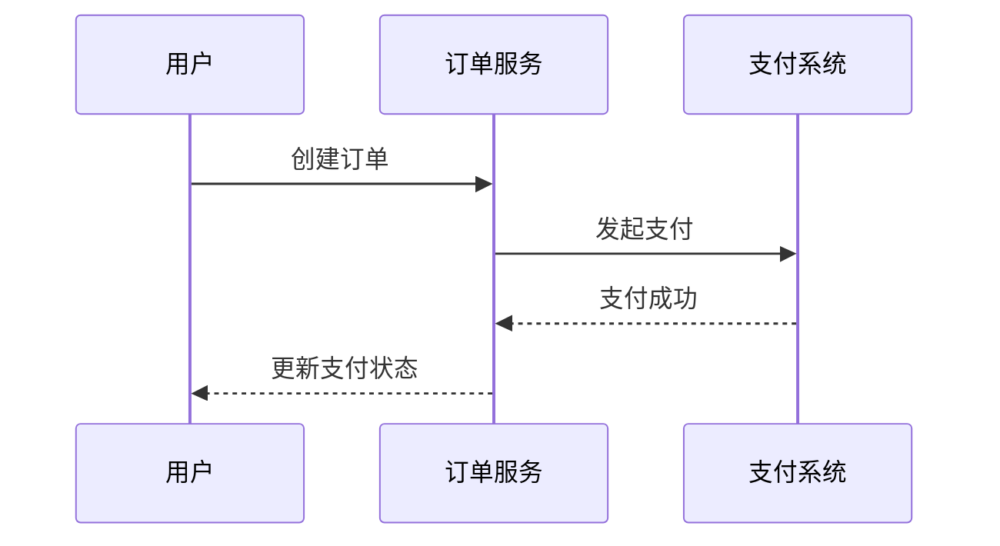
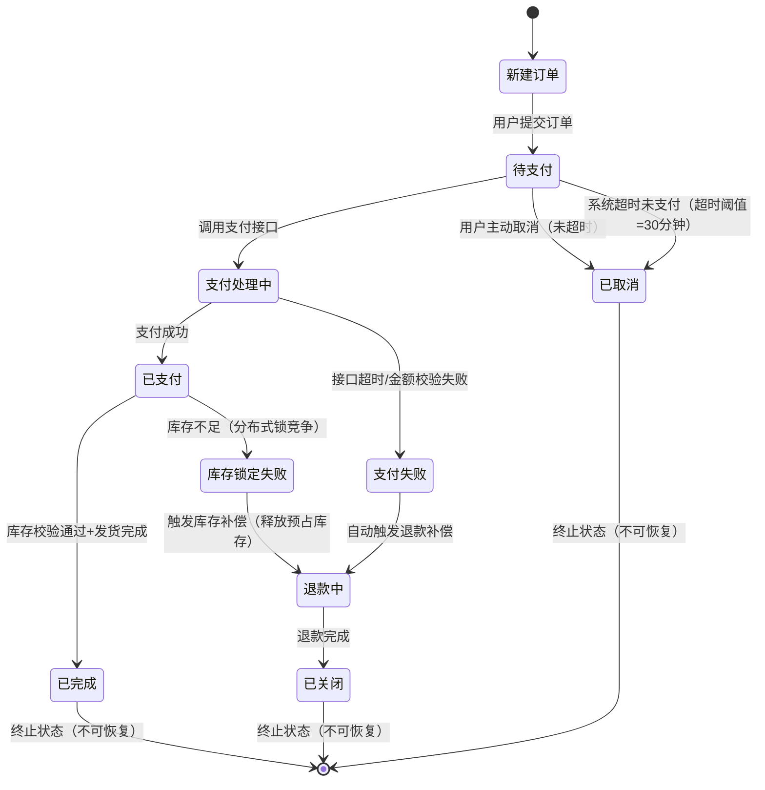
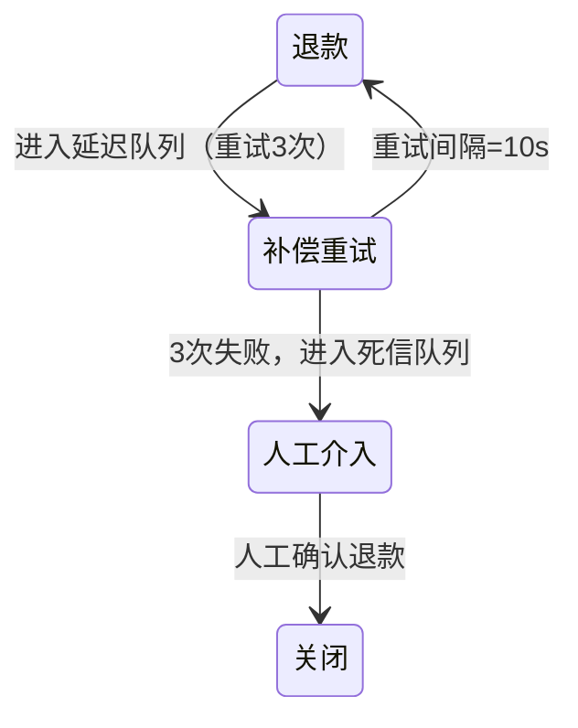
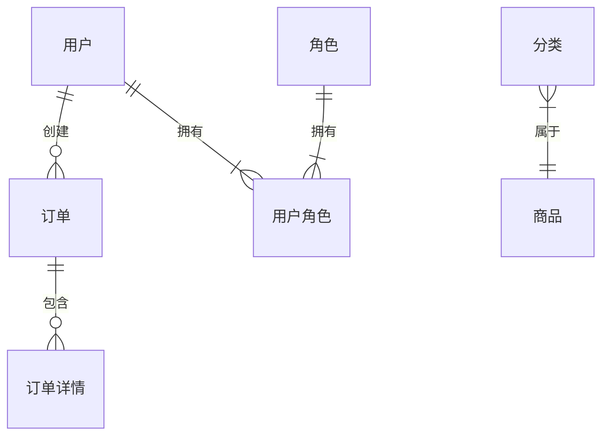
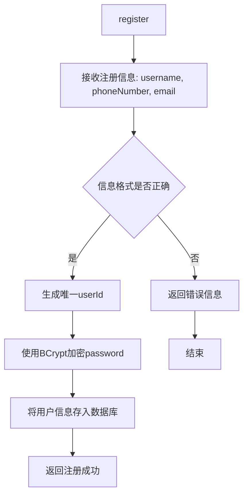

# 前言: Scrum中的技术设计活动
在大型项目中，完成架构设计阶段后，其余的概要设计以及几乎所有的详细设计都在后续的每个迭代当中完成。通常，在最初的几个迭代当中，设计的时间占比通常较高；在后续迭代当中，随着软件整体架构和组件趋于稳定，设计的时间占比逐渐减少。
在敏捷项目中，适当地开展架构设计，可以避免产生过多“技术债”(technical debt)，我们避免过多累积”quick-and-dirty”的实现方法。

## 1 架构设计活动
敏捷中的架构设计分为如下几种情况：
1. 如果建设一个需求明确且相对稳定的大型复杂系统，最好在项目早期进行专门的架构设计。在KTECH的敏捷开发流程当中，架构设计通常是在Sprint 0当中完成的，一部分概要设计也在Sprint 0当中完成。
2. 如果建设大中型、需求比较模糊的系统，则可以快速用几天时间开始建立一个备选架构，细节不必特别清晰。后续再改变以及完善细节。这样一个备选架构在早期可以帮助讨论和收集需求，增加团队对系统的理解，帮助创建一些技术模板（例如编码模板）和项目管理标准。
3. 如果建设需求比较模糊的小型项目，团队成员需要确定所使用的主要框架和模式，无需编写大量的文档。

但无论上述那种情况，架构应该是有韧性（resilient）和松耦合的，这样未来易于修改。

## 2 概要设计活动
在 Sprint 计划会议确定本次迭代要完成的产品 Backlog 条目后，由技术负责人、模块负责人、组长，在迭代初期进行概要设计。针对本次迭代要开发的功能，设计相关模块的组成和交互。
对于一个大型且逻辑复杂的系统，应尽可能细化系统功能模块，明确模块间的复杂调用关系和数据交互流程，对数据库进行详细的逻辑设计，包括表结构优化、索引设计等，同时注重模块的复用性和可维护性，建立模块复用机制。
而像数据驱动的小型项目，逻辑主要是标准的CRUD，则应减少不必要的设计和文档工作，通过简洁规划功能模块，明确模块基本职责和接口，以满足核心功能实现为目标。

## 3 详细设计活动
在迭代执行过程中，开发人员在着手编码前，针对自己负责的任务进行详细设计，同时记录设计文档，也可以在开发完成后补充文档。应适当借助Draw.io等设计工具，Swagge等接口文档生成工具，保证输出的文档风格统一和内容完整。

# 一、架构设计
架构设计是系统的顶层规划，旨在定义系统的整体结构、组件划分、交互机制及技术选型，确保系统具备高可用性、可扩展性与可维护性，支撑业务目标的实现。
在大量的可能结构中，可以使用不同的结构来实现同样的功能性，即功能性在很大程度上是独立于结构的，因此架构设计应关注对结构的选择，在满足功能属性的前提下，满足质量属性。

参考：
《软件架构实践（第三版）》
《系统架构设计师教程（第四版）》


## 1 架构需求分析
### 1.1 识别关键架构需求
关键架构需求 （architecturally significant requirement，ASR）是显著影响架构中的结构选择的需求。ASR 通常分为四类。

- **约束**：给定或选定的不可更改的设计决策
- **质量属性**：外部可见特性，表征系统在特定环境下的运行情况
- **影响较大的功能需求**：架构设计需要特别注意的特性和功能
- **其他影响因素**：时间、知识、经验、技术、办公室政治、架构师技术特长等

识别关键架构的核心目标是确认质量属性。质量属性会在整个设计过程中用来指导挑选技术、结构、模式，以及评估设计决策的合理性。

挖掘关键架构需求的方法：
- 阅读PRD
- 头脑风暴
- 利益相关访谈
- 假设清单
- 开展质量属性研讨会

### 1.2 描述质量属性

质量属性主要分为 6 种，其他的质量属性一般可纳入这几个属性中：
- 可用性
- 可修改性
- 性能
- 安全性
- 可测试性
- 易用性

质量属性描述了软件系统的外部可见特性以及我们对系统运行的期望，它也定义了系统执行某些操作时的表现（质量需求）。


#### 质量属性场景
利用质量属性场景来明描述质量属性，可赋予抽象的属性（可扩展性、可用性、性能等）具体的含义（业务场景、需求），映射关键架构需求，并提供度量标准。


- 刺激源：生成该刺激的实体（人、计算机系统或其他激励器）；
- 刺激：刺激到达系统时可能产生的
- 影响（即需要考虑和关注的情况）；
- 环境：该刺激在某条件内发生。如系统可能正处于过载情况；
- 制品：系统中受刺激的部分（某个制品被刺激）；
- 响应：刺激到达后所采取的行动；
- 响应度量：当响应发生时，应能够以某种方式对应其度量，用于对是否满足需求的测试。

> 注：在架构需求分析阶段，应完成质量属性描述（刺激源、刺激、环境、制品），实现战术（响应）及度量方式（响应度量）则在设计决策阶段完成。

**示例 - 秒杀场景**
**刺激源**：大量用户（人）在电商平台的促销活动期间，同时发起商品下单请求。在 “双 11”“618” 等大型促销活动时，短时间内会有海量用户集中下单。​
**刺激**：系统可能面临服务器负载过高、响应延迟增加、订单处理出现错误甚至系统崩溃等情况，导致用户无法正常下单，严重影响用户体验和平台业务。​
**环境**：促销活动期间，系统处于高并发访问状态，服务器资源（如 CPU、内存、网络带宽等）接近或达到饱和，数据库的写入和读取操作频繁，系统整体压力巨大。​
**制品**：电商系统中的订单处理模块、数据库服务器以及相关的网络通信组件等，这些都是在用户下单请求到达时会受到刺激的部分。​
**响应**：当高并发下单请求到达时，系统采取以下行动：一是使用负载均衡器将请求均匀分配到多个服务器节点，避免单个服务器过载；二是采用消息队列缓存下单请求，进行异步处理，缓解系统瞬间压力；三是对订单处理模块进行限流，限制单位时间内的订单处理数量，保证系统稳定运行。​
**响应度量**：可以通过以下方式进行度量。一是测量系统的响应时间，要求在高并发情况下，订单处理的平均响应时间不超过 2 秒；二是统计订单处理的成功率，确保订单处理成功率不低于 99%；三是监控服务器的 CPU 和内存使用率，保证其使用率不超过 80% 。通过这些度量指标，可以测试系统是否满足高并发下单处理的质量需求。

## 2 架构设计

在实践中，每个架构设计决策都至少会提升或抑制一个质量属性。大多数设计决策在提升某些质量属性的同时抑制了其他的质量属性，牺牲某个质量属性换取另一个质量属性。

质量属性关系矩阵（“+”代表行属性能促进列属性，“-”则相反）：


### 2.1 可用性设计
#### 错误检测
- 命令/响应：一个构件发出一个命令，并希望在预定义的时间内收到一个来自审查构件的响应，例如远程错误的检测。
- 心跳（计时器）：一个构件定期发出一个心跳消息，另一个构件收听到消息，如果未收到心期发出一个心跳消息，另一个构件收听到消息，如果未收到心跳消息，则假定构件失败，并通知错误纠正构件。跳消息，则假定构件失败，并通知错误纠正构件。
- 异常：当出现异常时，异常处理程序开发执行。

#### 错误恢复
- 表决：通过冗余构件（或处理器）与表决器连接，构件按相同的输入及算法计算输出值交给表决器，由表决器按表决算法（如多数规则）确定是否有构件出错，表决通常用在控制系统中。
- 主动冗余（热重启、热备份）：所有的冗余构件都以并行的方式对事件做出响应。它们都处在相同的状态，但仅使用一个构件的响应，丢弃其余构件的响应。错误发生时通过切换的方式使用另一个构件的响 应。
- 被动冗余（暧重启/双冗余 /三冗余）：一个构件（主构件）对事件做出响应，并通知其他构件（备用的）必须进行的状态更新（同步）。当错误发生时，备用构件从最新同步点接替主构件的工作。
- 备件：备件是计算平台配置用于更换各种不同的故障构件。状态再同步：主动和被动冗余战术要求所恢复的构件在重新提供服务前更新其状态。更新方法取决于可以承受的停机时间、更新的规模及更新的内容多少。
- 检查点/回滚：检查点就是使状态一致的同步点，它或者是定期进行，或者是对具体事件做出响应。当在两检查点之间发生故障时，则以这个一致状态的检查 点（有快照）和之后发生的事务日志来恢复系统（数据库中常使用）。

#### 错误预防
- 从服务中删除：如删除进程再重新启动，以防止内存泄露导致故障的发生。
- 事务：使用事务来保证数据的一致性，即几个相关密切的步骤，要么全成功，要么都不成功。
- 进程监视器：通过监视进程来处理进程的错误。

### 2.2 可修改性设计
#### 局部化修改
在设计期间为模块分配责任，以便把预期的变更限制在一定的范围内，从而降低修改的成本。
- 维持语义的一致性：语义的一致性指的是模块中责任之间的关系，使这些责任能够协同工作，不需要过多地依赖其他模块。耦合和内聚指标反映一致性，应该根据一组预期的变更来度量语义一致性。使用“抽象通用服务”（如应用框架的使用和其他中间软件的使用）来支持可修改性是其子战术。
- 预期期望的变更：通过对变更的预估，进行预设、准备，从而使变更的影响最小。泛化该模块：使一个模块更通用、更广泛的功能。
- 限制可能的选择：如在更换某一模块（如处理器）时，限制为相同家族的成员。

#### 防止连锁反应
由于模块之间有各种依赖性，因此，修改会产生连锁反应。
- 信息隐藏：就是把某个实体的责任分解为更小的部分，并选择哪些信息成为公有的，哪些成为私有的，通过接口获得公有责任。维持现有的接口：尽可能维持现有接口的稳定性。例如通过添加接口（通过新的接口提供新的服务）可以达到这一目的。
- 限制通信路径：限制与一个给定的模块共享数据的模块。这样可以减少由于数据产生/使用引入的连锁反应。
- 仲裁者的使用：在具有依赖关系的两个模块之间插入一个仲裁者，以管理与该依赖相关的活动。仲裁者有很多种类型，例如：桥、调停者、代理等就是可以提供把服务的语法从一种形式转换为另一种形式的仲裁者。

#### 推迟绑定时间
系统具备在运行时进行绑定并允许非开发人员进行修改（配置）。
- 运行时注册：支持即插即用。
- 配置文件：在启动时设置参数。
- 多态：在方法调用的后期绑定。
- 构件更换：允许载入时绑定。

### 2.3 性能设计
#### 资源限制
- 减少处理事件流所需的资源：提高计算效率（如改进算法）、减少计算开销（如在可修改性
与性能之间权衡，减少 不必要的代理构件）。
- 减少所处理事件的数量：管理事件率、控制采样频率。
- 控制资源的使用：限制执行时间（如减少迭代次数）、限制队列大小。

#### 资源管理
- 引入并发：引入并发对负载平衡很重要。
维持数据或计算的多个副本：C/S 结构中客户机 C 就是计算的副本，它能减少服务器计算的压力；高速缓存可以存放数据副本（在不同速度的存储库之间的缓冲）。
- 增加可用资源：在成本允许时，尽量使用速度更快的处理器、内存和网络。
  
#### 资源调度
- 先进/先出（FIFO）
- 固定优先级调度：先给事件分配特定的优先级，再按优先级高低顺序分配资源；
- 动态优先级调度：轮转调度、时限时间最早优先；
- 静态调度：可以离线确定调度。

### 2.4 安全性设计
#### 抵抗攻击
- 对用户进行身份验证：包括动态密码、一次性密码、数字证书及生物识别等；
- 对用户进行授权：即对用户的访问进行控制管理；
- 维护数据的机密性：一般通过对数据和通信链路进行加密来实现；
- 维护完整性：对数据添加校验或哈希值；限制暴露的信息；
- 限制访问：如用防火墙、DMZ 策略。

#### 检测攻击
一般通过“入侵检测”系统进行过滤、比较通信模式与历史基线等方法。

#### 从攻击中恢复
- 恢复：与可用性中的战术相同；
- 识别攻击者：作为审计追踪，用于预防性或惩罚性目的。

### 2.5 可测试性设计
#### 优化输入/输出
- 记录/回放：指捕获跨接口的信息，并将其作为测试专用软件的输入；
- 将接口与实现分离：允许使用实现的替代（模拟器）来支持各种测试目的；
- 优化访问线路/接口：用测试工具来捕获或赋予构件的变量值。

#### 内部监控
当监视器处于激活状态时，记录事件（如通过接口的信息）。

### 2.6 可修改性设计
#### 运行时战术
- 任务的模型：维护任务的信息，使系统了解用户试图做什么，并提供各种协助。
- 用户的模型：维护用户的信息，例如使系统以用户可以阅读页面的速度滚动页面。
- 系统的模型：维护系统的信息，它确定了期望的系统行为，并向用户提供反馈。

#### 设计时战术
将用户接口与应用的其余部分分离开来，预计用户接口会频繁发生变化，因此，单独维护用户接口代码将实现变更局部化。这与可修改性相关。

#### 支持用户主动操作
支持用户的主动操作，如支持“取消”、“撤销”、“聚合”和 “显示多个视图”。

### 2.7 常见设计示例
性能设计
- **缓存策略**：采用多级缓存机制，如本地缓存（Caffeine）+ 分布式缓存（Redis），减少数据库查询次数；对热点数据设置合理的缓存过期时间，并使用缓存预热技术，在系统启动时提前加载热点数据到缓存。​
- **异步处理**：将耗时操作（如订单生成后的报表统计、邮件通知）异步化处理，通过消息队列或异步任务框架（如 Spring Task、XXL-JOB）实现，避免阻塞主线程，提高系统响应速度。​
- **数据库优化**：合理设计索引，避免全表扫描；对大表进行分区（如按时间、ID 范围分区）；定期清理历史数据，保持数据库性能。

高可用设计
- **多副本部署**：每个微服务在 K8s 集群中部署多个副本，通过负载均衡器（如 Ingress Controller）实现流量分发，当某个副本出现故障时，自动将流量切换到其他副本。​
- **故障转移**：Nacos 提供集群模式，保证服务注册中心的高可用；数据库采用主从复制（MySQL 主从架构）+ 读写分离，主库负责写操作，从库负责读操作，当主库故障时，自动切换到从库继续提供服务。​
- **容灾备份**：定期对数据库进行全量备份和增量备份，备份数据存储在异地数据中心；对关键业务数据（如订单数据、用户数据）进行多副本存储，防止数据丢失。

安全性设计
- **身份认证与授权**：采用 JWT（JSON Web Token）进行用户身份认证，用户登录成功后，服务器生成 JWT 令牌返回给客户端，客户端在后续请求中携带令牌进行认证；基于 RBAC（基于角色的访问控制）模型实现权限管理，不同角色拥有不同的操作权限。​
- **数据加密**：对敏感数据（如用户密码、支付信息）在传输和存储过程中进行加密处理。传输时使用 HTTPS 协议，通过 SSL/TLS 加密数据；存储时使用 AES 等对称加密算法对数据进行加密，加密密钥安全存储。​
- **漏洞扫描与防护**：定期使用 OWASP ZAP、Nessus 等工具对系统进行安全漏洞扫描，及时发现和修复 SQL 注入、XSS 攻击、CSRF 攻击等安全漏洞；部署 Web 应用防火墙（WAF），对恶意请求进行拦截。

## 3 架构模式选型
参考：
《主流技术架构分析》
《KTech New Platform 架构原则》

## 4 技术和框架选型
参考：
《KTech New Platform 技术选型》


# 二、概要设计

**阶段及主要产出：**

| 设计阶段           | 产出                           |
| ------------------ | ------------------------------ |
| 业务流程建模       | 时序图、状态转换图、补偿机制表 |
| 系统服务设计       | 服务拓扑图                     |
| 面向对象设计和建模 | UML类图                        |
| 数据库设计         | E-R图                          |

## 1 业务流程建模(结构化分析设计)
业务流程建模是衔接业务需求与技术实现的核心桥梁，这一阶段的主要目标是了解软件系统的需求和目标，回答系统必须“做什么”，并通过图表业务逻辑关系，为后续的设计阶段提供基准。

业务流程建模的主要目标：
- 消除业务与技术之间的认知鸿沟
- 识别流程中的阻塞点（Bottleneck）和单点故障（SPOF）
- 为技术方案提供可验证的输入基准
- 为测试方案提供可验证的输入基准

**通常，流程建模的输入来自PRD文档，包括业务流程图、业务规则说明、用户角色矩阵、功能用例清单等。**

### 步骤1：绘制时序图，表达主流程
时序图主要展示对象之间的交互顺序，通过视图明确系统组件与角色的协作逻辑。

1. 拆解角色与组件
   - 从 PRD 中提取参与流程的实体（如用户、支付系统、库存系统）边界
   - 标注外部系统（如第三方支付）与内部模块（如订单服务）的交互边界
2. 映射时序
以用户触发事件为起点（如 “用户下单”），按时间顺序绘制消息传递链条，例如：


3. 补充关键元素
   - 在消息箭头上标注业务规则（如 “订单金额> 0”“库存校验通过”），关键节点添加「约束条件」注释
   - 验证消息顺序并补充循环逻辑（如重试机制）

### 步骤2：绘制状态图，管理实体生命周期
状态图通过描述系统的状态和引起系统状态转换的事件，来表示系统的行为，指出作为特定事件的结果将执行哪些动作（例如处理数据等）。步骤如下：
1. **获取业务实体**
   通常实体以名词出现在时序图的流程连线中，如（订单、支付）
2. **状态定义**
   枚举业务实体的最小状态单元（如订单状态：待支付、已支付、已取消、已完成），排除模糊状态（如 “处理中” 需细化为 “支付处理中”“发货处理中”）。
3. **建立状态转换模型**
   绘制状态节点与转换箭头，标注触发事件（如 “用户取消” 触发订单从 “待支付” 到 “已取消”）和前置条件（如 “未支付且未超时”）。
4. **特殊场景处理**
   - 并行状态：如 “订单已支付” 与 “物流待揽收” 可同时存在（用 UML「组合状态」表示）。
   - 历史状态：通过「状态日志」记录跃迁历史（如 “已退款→已关闭”）。



### 步骤3：建立异常处理矩阵，覆盖边界条件
异常处理矩阵通过结构化表格的形式，将 “异常类型 - 触发条件 - 处理措施 - 验证标准” 等要素关联起来，确保边界条件覆盖的完整性和可追溯性。步骤如下：

1. 从时序图中提取所有可能的失败点，枚举异常场景
    - 支付环节：支付超时、余额不足、支付渠道不可用
    - 库存环节：库存锁竞争失败、超卖、库存数据不一致
    - 通用环节：参数校验失败、权限校验失败、网络中断
2. 按优先级分类异常
    - 高风险：支付接口超时（高频发生，阻断主流程，需立即处理）
    - 中风险：库存预占失败（高并发场景偶发，触发补偿流程）
    - 低风险：用户输入格式错误（前端可拦截，影响有限）
3. 设计异常处理策略，输出异常处理矩阵
    示例-支付流程异常矩阵：
    | 异常类型       | 触发条件                   | 影响范围       | 处理策略                |
    | -------------- | -------------------------- | -------------- | ----------------------- |
    | 支付渠道不可用 | 支付网关返回 503 错误      | 阻断主流程     | 熔断 + 切换备用渠道     |
    | 金额校验失败   | 订单金额与支付金额不一致   | 阻断主流程     | 返回异常信息 + 记录日志 |
    | 重复支付       | 同一订单号重复提交支付请求 | 数据一致性风险 | 幂等校验 + 自动退款     |
    | 银行对账差异   | 支付成功但银行流水未同步   | 数据最终一致性 | 每日自动对账 + 人工调账 |

### 步骤4：设计补偿机制，保障最终一致性
通过关联状态图与异常矩阵，识别无法到达终态的异常，设计对应的状态转换和补偿动作，例如：
| 异常类型       | 目标状态     | 补偿动作                        |
| -------------- | ------------ | ------------------------------- |
| 支付接口超时   | 支付失败     | 退款补偿 + 释放库存预占         |
| 库存锁竞争失败 | 库存锁定失败 | 回滚已扣减的用户积分 + 通知运营 |

操作要点：
1. 通过状态图识别异常长事务
   如 “下单 - 支付 - 关闭”，将其拆分为可补偿的原子操作单元，并为每个单元定义正向操作与补偿操作如：
   - 正向：支付成功，支付失败
   - 补偿：退款
2. 选择补偿策略
   - 自动补偿：适用于无人工干预场景（如支付失败后自动退款），需确保补偿接口幂等性（通过唯一事务 ID 防重放）。
   - 人工补偿：适用于复杂异常（如库存差异需人工盘点），设计补偿工单系统，记录补偿进度与操作日志。



## 2 系统服务设计(服务/模块划分)
### 2.1 识别实体
#### 名词提取法
从业务需求文档（PRD）、用户故事、用例描述等材料中，提取所有具有实际业务意义的名词作为候选实体。例如，在电商系统的需求描述 “用户在商品详情页浏览商品信息，将心仪商品加入购物车，下单后生成订单并进行支付” 中，可提取出 “用户”“商品”“商品详情页”“购物车”“订单”“支付” 等候选实体。在此过程中，需排除无独立业务价值的名词，如 “页面” 这种纯技术概念，而聚焦 “商品” 这类承载业务数据的服务实体。

#### 角色抽象法
梳理核心业务流程，分析流程中参与交互的角色和对象，并将其抽象为实体。以订单创建流程为例，涉及用户提交订单、订单服务处理订单、库存服务校验库存、支付服务完成支付等环节，可从中识别出 “用户”“订单服务”“库存服务”“支付服务” 等实体。对于流程中具有特定职责的角色，如 “库存管理员”，若其业务操作与库存服务紧密相关，可将其职责整合到 “库存服务” 实体中，避免过度细化。

#### 限界上下文分析法
在领域驱动设计中，根据业务领域的边界，划分不同的限界上下文，每个上下文内包含相关的实体。在电商系统中，可划分为 “用户域”“商品域”“订单域”“支付域” 等。在 “订单域” 中，核心实体为 “订单”，同时包含 “订单明细”“订单状态” 等相关实体；而 “支付域” 则围绕 “支付记录”“支付方式” 等实体展开。通过限界上下文，明确各实体的职责范围，避免不同领域的实体混淆。

#### 参考现有系统或行业标准
若存在类似的现有系统，可参考其已有的实体设计；同时，借鉴行业通用标准和规范，确定符合业务领域的实体。例如，在金融行业的支付系统设计中，可参考银联、支付宝等支付机构的接口规范，确定 “支付”、“交易” 等标准实体；在电商行业，可依据行业惯例确定 “商品”、“库存” 等实体。

### 2.2 划分服务
#### 划分原则
1) 单一责任原则（SRP+）
每个服务只处理一个完整业务域（如订单域、用户域）
禁止出现跨领域交叉（如支付服务不应包含库存扣减逻辑）
2) 自治性原则
服务可独立开发、部署、扩展
数据自治：服务拥有私有数据库，禁止直接跨库查询
3) 通信效率原则
高频交互的功能应合并到同一服务
跨服务调用链不超过3跳（如 A->B->C 已达上限）

#### 划分方法
- 按照业务模块划分
- 按照事务划分(事务一致性分析)
- 按照性能热点划分：划分后是否会存在性能问题。比如链路过长、调用接口过多、数据量级同步过大等
- 按照成本划分：是否会产生额外的沟通交流、运营成本
- 按照质量划分：是指在业务领域划分后，是否会产生质量风险。比如数据同步风险、流量过大风险等

#### 争议解决方案
**案例**：商品评价功能划分

| 归属服务        | 优点           | 缺点                     |
| --------------- | -------------- | ------------------------ |
| Product-Service | 信息聚合度高   | 评价的读写影响主流程QPS  |
| Review-Service  | 独立、扩展性强 | 需跨服务获取商品基础数据 |

**决策路径：**
1. 是否与主实体强绑定？ → 是 → 合并到主服务
2. 是否有独立业务规则？ → 是 → 独立服务
3. QPS是否超过标准？ → 是 → 独立服务

### 2.3 确定模块之间交互方式
- 同步调用：用于对实时性要求高且响应时间短的场景，例如用户登录验证。
- 异步调用：可确保不会因为某个通信环节阻塞整体流程，并借助重试机制达到最终一致性。
通常而言，应优先选择异步调用设计，确保不同服务间低耦合。但对于逻辑强依赖的两个服务（如登录验权服务强依赖用户账户服务），一个服务的异常会导致整体流程失败，则无法发挥异步调用的优势，选择同步调用设计即可。

#### 2.3.1 同步调用
- 在微服务架构中，模块间通过RPC框架进行同步调用。

````mermaid
graph LR
A[Service-A]
B[Service-B]
A --> |RPC|B
B -.-> A
````

- 非微服务架构及对外部服务的调用则可采用HTTP接口实现，但需要注意设计失败补偿机制。

````mermaid
graph LR 
subgraph Service-A 
Node1[Bussniss] --> Node2[Http Handler]  
Node2 -.-> |失败重试|Node2
end 

Node2 --> |Http|B[Service-B]
````

#### 2.3.2 异步调用
主要利用MQ、Kafka、Redis等中间件实现异步通信。


### 2.4 绘制服务拓扑图
示例：
```` mermaid
graph TD
    A[用户服务] --> |RPC|B[订单服务]
    B --> |RPC|C[商品服务]
    B --> |RPC|D[库存服务]
    B --> |Http|E[支付服务]
    F[物流服务] --> |MQ|B
    B --> |MQ|F
````

## 3 面向对象设计和建模
面向对象设计流程可概括为：

### 3.1 识别对象
即从业务需求、用户场景中识别和提取关键的业务概念、实体、规则和关系，并将其抽象为面向对象模型的基础元素（如类、对象、属性等）。为后续的设计（如UML类图、数据库设计等）提供基础。
主要的技巧有以下两种：

#### 名词短语分析法
通读PRD、用户故事，标记所有名词（实体）与动词（操作）：
- **实体类**：订单、用户、商品、库存、支付记录
- **边界类**：用户界面、第三方支付接口
- **控制类**：订单处理器、支付控制器

同时排除无关概念，如 “系统管理员” 若仅作为背景角色，不做建模。

#### 用例场景映射
分析业务流程模型，对每个用例（如 “用户下单”），识别参与对象：
```
用例：用户下单  
参与者：用户（边界类）  
实体：订单（实体类）、商品（实体类）、库存（实体类）  
控制：订单创建服务（控制类）  
```

### 3.2 定义类职责
即细化类的静态结构，定义属性和方法。
主要遵循以下原则：
- **原子性**：属性应为不可再分的基本数据类型（如订单金额→decimal(10,2)，而非字符串）
- **单一职责原理**：方法应聚焦单一功能（如OrderService.createOrder()仅负责创建订单，不包含支付逻辑）
- **面向接口**：定义抽象接口（如PaymentService），实现类（AlipayServiceImpl、WechatPayServiceImpl）继承接口

示例：

> 注：该阶段的产出为UML图中的类对象，实践中类对象详细的属性和方法是频繁变化的，概要设计阶段仅保证核心描述流程的属性和方法即可。

### 3.3 建立类间关联关系
运用面向对象架构模型，构建系统静态结构。

#### 3.3.1 分层架构
分层架构是比较实用并且通用的模式，对于多数程序是一个良好起点，尤其是当您不确定哪种架构模式最适合您的应用程序时。
````
┌───────────────────────┐
│   Presentation Layer  │
├───────────────────────┤
│   Business Logic      │
├───────────────────────┤
│   Data Access Layer   │
└───────────────────────┘
````
#### 3.3.2 洋葱架构（Clean-Architecture）
洋葱架构着重于解决分层架构中上层对下层的强依赖问题，如果业务逻辑（Business Logic）不存在，UI （Presentation Layer）将无法运行。如果没有数据访问（Data Access Layer），业务逻辑（Business Logic）就无法运行。而洋葱架构强调整个系统的关注点分离，使得应用程更易于维护。


#### 3.3.3 DDD
ddd是解决复杂业务系统的架构设计方式，并不适用于所有业务系统，在进行架构设计时需要考虑清楚ddd是否适用于现有业务。如果业务较简单，并不建议使用ddd,因为ddd带来的沟通成本、学习成本、维护成本都会增加。
ddd中的概念及设计原则可以进行借鉴，比如边界上下文、领域划分、防腐层、依赖倒置等，可以解决业务间依赖，使业务隔离。


#### 3.3.4 Event Sourcing与事件驱动架构
事件驱动架构（Event-Driven Architecture，简称EDA）和Event Sourcing是两种非常重要的软件架构设计模式，它们在近年来逐渐成为软件开发中的主流方法。事件驱动架构是一种基于事件的异步通信方式，它使得系统的各个组件可以在不同时间和不同位置之间进行通信，从而提高了系统的灵活性和可扩展性。而Event Sourcing则是一种基于事件的数据存储方法，它将数据存储为一系列事件的序列，从而实现了数据的完整性和可恢复性。

事件驱动架构和Event Sourcing是两种相互关联的软件架构设计模式，它们可以相互支持和完善。事件驱动架构可以让系统的各个组件更加灵活和可扩展，而Event Sourcing可以让数据更加完整和可恢复。在实际应用中，事件驱动架构和Event Sourcing可以相互支持，例如，事件驱动架构可以使用Event Sourcing来存储和处理事件，而Event Sourcing可以使用事件驱动架构来处理事件。


### 3.4 应用设计模式
利用设计模式，提升类的可维护性与扩展性。
设计模式原则：
- **开闭原则（OCP）**
将易变逻辑封装为策略类（如促销规则PromotionStrategy接口），新增促销方式时无需修改原有代码。
- **里氏替换原则（LSP）**
确保子类可完全替换父类（如VIPUser继承User时，支付方法返回值类型需一致）。
- **迪米特法则（LoD）**
减少类间不必要的直接依赖，通过中介者模式（Mediator）解耦（如订单与库存不直接交互，通过OrderMediator协调）。

#### 3.4.1 创建型模式（对象创建机制）
用于封装对象创建逻辑，解耦对象生成与使用，提升灵活性和复用性
| 模式       | 核心思想                                                           | 典型场景举例                                                                   |
| ---------- | ------------------------------------------------------------------ | ------------------------------------------------------------------------------ |
| 工厂方法   | 定义一个创建对象的接口，由子类决定实例化具体类（延迟到子类实现）。 | 电商系统中，根据不同支付方式（支付宝、微信支付）创建对应的支付处理器。         |
| 抽象工厂   | 提供一个创建相关或依赖对象族的接口，无需指定具体类。               | 跨平台 UI 组件库，创建不同操作系统（Windows/Mac）的按钮、窗口等组件族。        |
| 单例模式   | 确保类只有一个实例，并提供全局访问点。                             | 日志管理器、配置管理器（整个应用只需一个实例管理全局状态）。                   |
| 建造者模式 | 将复杂对象的构建过程与表示分离，允许相同构建过程创建不同表示。     | 订单生成：分步组装订单的用户信息、商品列表、配送地址、支付方式等复杂对象。     |
| 原型模式   | 通过复制现有对象（原型）创建新对象，避免重复初始化逻辑。           | 游戏中复制 NPC 角色：基于基础角色原型（如 “士兵”）快速生成多个属性微调的实例。 |

#### 3.4.2 结构型模式（类 / 对象的组合结构）
用于优化类或对象的组合方式，形成灵活的结构，解决复杂系统的层次和依赖问题。
| 模式       | 核心思想                                                                        | 典型场景举例                                                                            |
| ---------- | ------------------------------------------------------------------------------- | --------------------------------------------------------------------------------------- |
| 适配器模式 | 转换一个类的接口，使其能与另一个不兼容的接口协同工作（类适配器 / 对象适配器）。 | 旧系统兼容：将第三方支付接口（如 VISA）适配为系统内部统一的支付接口格式。               |
| 桥接模式   | 将抽象部分与实现部分分离，使两者可独立变化，通过组合而非继承关联。              | 跨平台图形系统：抽象 “图形”（如矩形、圆形）与 “平台实现”（Windows/GDI、Java/AWT）解耦。 |
| 组合模式   | 将对象组合成树形结构，统一处理单个对象（叶子）和组合对象（容器）。              | 文件系统：文件夹（容器）和文件（叶子）统一视为 “节点”，支持递归遍历、操作。             |
| 装饰器模式 | 动态给对象添加额外职责，通过包装器（Decorator）扩展功能，避免继承臃肿。         | 电商商品展示：给 “商品” 对象动态添加 “促销标签”“库存提醒”“价格高亮” 等附加功能。        |
| 外观模式   | 为复杂子系统提供统一接口，简化外部调用（门面模式）。                            | 视频播放系统：对外暴露简单的 “播放” 接口，内部封装解码、渲染、音频同步等复杂子系统。    |
| 享元模式   | 共享多个对象的公共状态，减少内存占用，适用于大量细粒度对象场景。                | 文本渲染：共享 “字符” 对象的字体、颜色等公共属性，不同位置的相同字符复用实例。          |
| 代理模式   | 为对象提供一个代理或占位符，控制对原对象的访问（远程代理、虚拟代理等）。        | 图片加载：使用代理对象先显示占位图，真实图片加载完成后替换，避免阻塞界面。              |

#### 3.4.3 行为型模式（对象交互与职责分配）
用于定义对象间的通信机制和算法分配方式，解耦复杂交互逻辑，提升系统灵活性和可维护性。
| 模式       | 核心思想                                                                           | 典型场景举例                                                                                                 |
| ---------- | ---------------------------------------------------------------------------------- | ------------------------------------------------------------------------------------------------------------ |
| 策略模式   | 定义一系列算法，将每个算法封装为独立策略类，可相互替换（策略族）。                 | 电商促销：不同促销策略（满减、折扣、赠品）动态切换，订单计算时按需选择策略。                                 |
| 模板方法   | 在抽象类中定义算法骨架，具体步骤由子类实现（钩子方法）。                           | 电商订单处理模板：抽象类定义 “创建订单→校验库存→扣款→发货” 骨架，子类实现 “扣款”（支付宝 / 微信）细节。      |
| 观察者模式 | 定义对象间的依赖关系，当主题（Subject）状态变化时，通知所有观察者（Observer）。    | 消息订阅：用户关注商品后，商品降价时自动通知所有订阅用户（微信 / 短信 / 站内信）。                           |
| 迭代器模式 | 提供统一接口遍历集合对象，隐藏内部数据结构（如数组、链表）。                       | 数据展示：表格组件通过迭代器遍历不同类型的数据集（列表、树结构），统一渲染。                                 |
| 责任链模式 | 将请求处理者连成链，请求沿链传递，直到有处理者响应（避免请求发送者与处理者耦合）。 | 审批流程：报销单按金额大小依次由组长、部门经理、CEO 审批，形成链式处理。                                     |
| 命令模式   | 将 “请求” 封装为对象（命令对象），支持日志、撤销、异步执行等操作。                 | 文本编辑器：“撤销” 功能通过记录命令对象（如 “插入文本”“删除文本”）实现回退。                                 |
| 备忘录模式 | 捕获对象内部状态并保存（备忘录），以便恢复到历史状态（撤销操作）。                 | 游戏存档：保存玩家当前游戏状态（血量、装备、进度），支持读档恢复。                                           |
| 状态模式   | 对象的行为随内部状态改变而变化，将状态逻辑封装为独立状态类。                       | 电商订单状态：订单根据状态（待支付、已支付、已发货、已取消）切换不同的操作逻辑（如 “已取消” 订单不可支付）。 |
| 访问者模式 | 封装作用于对象结构中各元素的操作，使操作可独立于元素类变化（数据与操作分离）。     | 电商报表：针对 “商品”“订单”“用户” 等不同元素，访问者（如 “销售额统计”“用户活跃度分析”）可灵活添加新操作。    |
| 中介者模式 | 用中介对象封装对象间的交互逻辑，避免对象直接引用，降低耦合（星型结构）。           | 即时通讯：用户（User）之间不直接通信，通过中介者（ChatMediator）转发消息，解耦用户关联。                     |
| 解释器模式 | 定义语言的文法（语法规则），并实现解释器来解析该语言中的句子（较少使用）。         | 表达式计算：解析数学表达式（如 “a + b * c”），根据文法规则计算结果（仅复杂场景使用）。                       |


## 4 数据库设计（概念结构设计）
通过 E-R 图（实体 - 关系图） 抽象业务概念，定义实体、属性及关系，形成独立于数据库管理系统的概念模型，为逻辑设计提供直接输入。

> 注：数据库设计流程包含概念结构设计和物理结构设计，概要设计阶段输出概念结构指导技术落地即可，物理结构待详细设计阶段补充。
>
> 

### 4.1 实体获取和定义
- 识别实体：
  - 从需求文档、用例图、业务流程图中提取名词短语，筛选具有独立业务含义且具有唯一标识的对象作为候选实体（如 “商品”“分类”），排除抽象概念（如“报表”、“缓存”、“日志”）
  - 从UML图提取对象实例，映射为数据库实体
- 定义关系：
    - 一对一（1:1）：用户与用户详情（1 个用户对应 1 个详情）
    - 一对多（1:M）：分类与商品（1 个分类包含多个商品）
    - 多对多（M:N）：用户与角色（1 个用户可拥有多个角色，1 个角色可分配给多个用户，需中间表）
- 属性分类：
    - 主键属性：唯一标识实体（如用户 ID）
    - 复合属性：可分解的属性（如 “地址” 分解为省、市、区）
    - 派生属性：通过计算得到（如 “订单总价” 由 “商品单价 × 数量” 派生）


### 4.2 绘制E-R图
示例：


# 三、详细设计
详细设计是将概要设计转化为可直接编码实现的技术文档，聚焦模块内部逻辑、算法、接口及数据结构设计。我将围绕业务流程、系统服务、用户界面等模块，细化实现细节和技术方案。
对应概要设计产出为:
| 设计阶段           | 产出            |
| ------------------ | --------------- |
| 业务流程建模       | 异常码清单      |
| 系统服务设计 | 服务接口清单 |
| 面向对象设计和建模 | 流程图、类属性-方法清单、设计模式/算法实现 |
| 数据库设计         | 数据库表清单    |

另外根据软件系统的类型，还可能要进行以下设计:
1) 代码设计。为了提高数据的输入、分类、存储和检索等操作，节约内存空间，对数据
库中某些数据项的值要进行代码设计
1) 输入/输出格式设计
2) 用户界面设计

## 1 业务流程建模详细设计
### 1.1 补充时序图实现细节
包括但不限于：
- 子流程：如库存锁定失败补偿流程
- 超时控制：如接口超时时长限制500ms，超时后触发熔断机制
- 幂等性设计：如在订单确认环节，重复请求直接返回已处理结果

### 1.2 状态图工程化
说明实现状态转换的技术，如：
- 状态机框架：Spring State Machine或其他框架构建状态转换逻辑，定义订单状态枚举类OrderStatus（NEW、PAID、CANCELED ）等​
- 事件驱动：每个状态转换对应明确的事件，如PAY_SUCCESS事件触发订单从NEW到PAID状态迁移，并自动调用库存扣减服务
- 流程驱动：利用流程引擎驱动状态转换

### 1.3 异常码清单
依据异常处理矩阵和最终程序实现，补充异常码清单，如：
| Error Code | Error Message |
| ---------- | ------------- |
| 10001      | 参数错误      |
| 10002      | 支付失败      |
| 10003      | 库存锁定失败      |

## 2 系统服务详细设计
### 2.1 服务间通信
补充详细的通信实现方式，如：
- **RPC 调用**：使用 gRPC 实现服务间高效通信，定义 Proto 文件规范数据格式。例如，用户服务与订单服务之间的用户信息查询采用 gRPC 调用，提升传输效率。​
- **消息队列**：通过 RabbitMQ 实现异步解耦，如订单创建成功后，发送消息通知物流服务进行发货处理。
  
### 2.2 服务接口定义
补充系统服务间通信的详细API及安全协议，输出接口清单。
- **RESTful API 设计**：遵循 OpenAPI 规范，使用Swagger等工具生成接口文档。
  以商品服务为例，定义以下接口：​
    GET /products/{productId}：获取商品详情​
    POST /products：创建商品​
    PUT /products/{productId}：更新商品信息​
- **接口安全**：如JWT令牌、auth2等认证机制，及接口网关等设计。

## 3 面向对象详细设计
### 3.1 类的实现细节

#### 3.1.1 复杂逻辑方法流程图​
针对复杂的业务逻辑和方法调用补充设计细节，以User类的注册方法register和为例，绘制流程图：


#### 3.1.2 补充类属性-方法清单清单
示例 - User 类：

| 类属性名称  | 数据类型      | 说明            | 约束条件                   |
| ----------- | ------------- | --------------- | --------------- |
| userId      | int           | 用户唯一标识 ID | 唯一索引                   |
| username    | String        | 用户姓名        | 非空，长度不超过 50        |
| phoneNumber | String        | 用户手机号码    | 非空，唯一，符合手机号格式 |
| email       | String        | 用户电子邮箱    | 可空，符合邮箱格式         |
| createTime  | LocalDateTime | 用户创建时间    | 默认值为当前时间           |

| 类方法名称    | 方法返回值 | 说明                                                                         | 参数列表                                                      |
| ------------- | ---------- | ---------------------------------------------------------------------------- | --------------- |
| register      | boolean    | 用户注册方法，将用户信息保存到系统中。                                       | username, phoneNumber, email（可选）                          |
| login         | boolean    | 用户登录验证方法，根据用户名和密码（假设密码在其他逻辑中处理）验证用户身份。 | username, password（假设传入）                                |
| updateProfile | void       | 更新用户个人信息方法，可更新除 userId 外的其他信息。                         | newUsername（可选）, newPhoneNumber（可选）, newEmail（可选） |

### 3.2 设计模式和算法实现细节
必要时补充，如：

> **策略模式​**
> - 应用场景：处理不同支付方式（支付宝、微信支付、银联支付），使支付逻辑可动态切> 换
> - 实现细节：定义抽象支付策略接口PaymentStrategy，包含pay方法；具体支付类如> AlipayStrategy、WechatPayStrategy等实现该接口。在订单支付时，根据用户选择的> 支付方式调用对应的策略实现支付
> ```` java
> interface PaymentStrategy {
>     boolean pay(BigDecimal amount, String orderId);
> }
> 
> class AlipayStrategy implements PaymentStrategy {
>     @Override
>     public boolean pay(BigDecimal amount, String orderId) {
>         // 调用支付宝支付接口逻辑
>         System.out.println("使用支付宝支付，订单号：" + orderId + "，金> 额：" + amount);
>         return true;
>     }
> }
> 
> class WechatPayStrategy implements PaymentStrategy {
>     @Override
>     public boolean pay(BigDecimal amount, String orderId) {
>         // 调用微信支付接口逻辑
>         System.out.println("使用微信支付，订单号：" + orderId + "，金额：> " + amount);
>         return true;
>     }
> }
> ````

> **用户密码加密与验证算法​**
> - 应用场景：用户注册时加密密码存储，登录时验证密码正确性。
> - 实现细节：使用 BCrypt 算法进行密码加密，在User类的register方法中对用户输入> 的密码调用BCrypt.hashpw方法加密后存储；在login方法中，使用BCrypt.checkpw方> 法对比输入密码与数据库中加密密码是否匹配
> ```` java
> import org.mindrot.jbcrypt.BCrypt;​
> ​
> public class User {​
>     private String passwordHash;​
> ​
>     public void register(String password) {​
>         passwordHash = BCrypt.hashpw(password, BCrypt.gensalt());​
>     }​
> ​
>     public boolean login(String password) {​
>         return BCrypt.checkpw(password, passwordHash);​
>     }​
> }
> ````

## 3 数据库设计详细设计（物理结构设计）
数据库物理结构设计将E-R图转换为关系模式，选型具体的数据库系统，设计表、索引、存储策略，优化性能与存储效率。
实际上，数据库设计的基本过程与任何复杂系统开发一样，在每一阶段设计基本完成后，都要进行认真的检查，看是否满足应用需求，并析设计结果的合理性。在每一步设计中，可能发现前面步骤的遗漏或处理不当之处，此时，往往需要返回去重新处理并修改物理结构。所以，物理结构设计过程通常是一个反复修改、反设计的迭代过程。

### 4.1 操作要点
1. DBMS 选型
    - 关系型数据库（OLTP）：MySQL（常用）、PostgreSQL（高并发）、Oracle（强事务）
    - 非关系型数据库（OLAP）：MongoDB（文档存储）、Cassandra（分布式海量数据）
1. 表结构优化
    - 字段顺序：常用字段前置（如user_id、create_time放前，提升查询效率）。
    - 自增主键：使用AUTO_INCREMENT（MySQL）或SEQUENCE（Oracle），避免业务字段作为主键（如用户手机号可能变更）。
1. 分区设计：
    - 按时间分区：order表按年份分表（order_2023、order_2024），降低单表数据量。
    - 按范围分区：用户表按user_id范围分布（1-100 万、100 万 - 200 万），均衡负载。
1. 索引设计
    - 必加索引：主键（自动创建）、外键、唯一约束字段（如user.mobile）。
    - 组合索引：遵循 “最左匹配” 原则（如(user_id, create_time)支持user_id单查或两者联合查询）。
   - 避免过度索引：写入频繁的表（如日志表）减少索引，避免插入 / 更新性能下降。
2. 存储引擎选择
    - MySQL：
      - InnoDB：支持事务、外键，适合 OLTP（订单、用户表）。
      - MyISAM：不支持事务，适合只读报表表。
    - PostgreSQL：使用默认Heap存储，或针对高频查询用BRIN索引（范围查询优化）。

### 4.2 示例 - 数据库表清单
#### 表清单
| 表名       | 说明       | 依赖/引用                           |
| ---------- | ---------- | ----------------------------------- |
| user       | 用户表     |                                     |
| order      | 订单表     | 依赖 user 表，引用其 user_id 字段   |
| order_item | 订单详情表 | 依赖 order 表，引用其 order_id 字段 |
| product    | 商品表     |                                     |
#### 表说明
**订单详情表**
- 索引设计：order_id和product_id字段上创建联合索引，提升用户订单查询效率​
- 分表：按id范围进行分区，减少单表数据量，提高查询性能

| 字段名        | 数据类型 | 字段说明                                     |
| ------------- | -------- | -------------------------------------------- |
| order_item_id | int      | 订单详情 ID，主键                            |
| order_id      | int      | 订单 ID，外键，关联 order 表的 order_id 字段 |
| product_id    | int      | 订单 ID，外键，关联 order 表的 order_id 字段 |
| quantity      | int      | 商品数量                                     |

